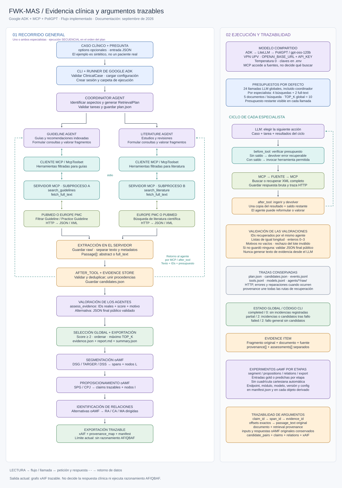

# FWK-MAS · Evidencia clínica y construcción de argumentos

Sistema multiagente en Python con **Google ADK**, **MCP**, **PoliGPT** y una capa modular **oAMF**. Recupera evidencia clínica y puede transformarla en spans, proposiciones, relaciones dirigidas y un grafo xAIF trazable.

La decisión clínica y el razonamiento AF/QBAF quedan fuera del sistema. La capa implementada termina en el grafo xAIF y su mapa de procedencia.

**Diagrama editable:** [Excalidraw](docs/flujo-funcionamiento.excalidraw). **Vista previa:** [SVG](docs/flujo-funcionamiento.svg).

## Contenido

- [Inicio rápido](#inicio-rapido)
- [Origen del caso de ejemplo](#caso)
- [Arquitectura y recorrido completo](#arquitectura)
- [Instalación y configuración](#configuracion)
- [Comandos y entrada](#comandos)
- [Herramientas y fuentes](#herramientas)
- [Contratos de datos](#datos)
- [Normalización y selección](#seleccion)
- [Archivos, métricas y estados](#salidas)
- [Pruebas y ejecución verificada](#pruebas)
- [Resolución de problemas](#problemas)
- [Mapa del código y ampliaciones](#desarrollo)
- [Minería de argumentos con oAMF](#argument-mining)
- [Limitaciones y trabajo posterior](#limitaciones)
- [Uso y mantenimiento del diagrama](#diagrama)
- [Referencias](#referencias)

<a id="inicio-rapido"></a>
## Inicio rápido

Desde la raíz del proyecto, con `.venv` instalado y `.env` configurado, activa la VPN de la UPV y ejecuta:

```powershell
.\.venv\Scripts\python.exe -X utf8 -m clinical_retrieval --case examples/case.json
```

La consola indica cuándo termina cada agente y la carpeta de resultados. Abre `report.md` para inspeccionar los fragmentos y `summary.json` para comprobar el estado. `evidence.json` es la selección estructurada; `candidates.json` conserva también lo no seleccionado.

Para probar sólo las fuentes reales por MCP, sin LLM:

```powershell
.\.venv\Scripts\python.exe -X utf8 -m clinical_retrieval.check_sources
```

<a id="caso"></a>
## Origen del caso de ejemplo

**[examples/case.json](examples/case.json) es un caso sintético creado por el asistente durante la implementación para probar el flujo.** No corresponde a un paciente real y no fue extraído de CasiMedicos, de una publicación ni del documento del paper.

Describe una persona de 67 años con diabetes tipo 2, enfermedad renal crónica, eGFR de 38 ml/min/1,73 m², albuminuria persistente y tratamiento con metformina. La pregunta solicita evidencia sobre inhibidores de SGLT2. Es una entrada de prueba, no un caso clínicamente adjudicado ni un ejemplo gold.

Las evidencias de las ejecuciones reales sí se recuperan de PubMed/Europe PMC. Las respuestas en `tests/fixtures.py`, en cambio, son también sintéticas y sólo sirven para las pruebas sin red.

### Caso CasiMedicos aportado por el usuario

[examples/casimedicos_402_183.json](examples/casimedicos_402_183.json) contiene el registro `402_183` proporcionado por el usuario: una paciente adolescente solicita amistad en Facebook a su médico. Se reconstruyeron las nueve frases del contexto, la pregunta y las cuatro opciones originales en inglés. Se excluyeron la opción vacía `5- nan`, `CORRECT ANSWER`, la explicación posterior, las etiquetas BIO y las relaciones de referencia. Es una adaptación de ese registro concreto, no un importador general del dataset.

```powershell
.\.venv\Scripts\python.exe -X utf8 -m clinical_retrieval --case examples/casimedicos_402_183.json
```

<a id="arquitectura"></a>
## Arquitectura y recorrido completo



### Componentes y responsabilidades

| Componente | Responsabilidad |
| --- | --- |
| Google ADK | Agentes, Runner, sesiones, callbacks, eventos y cliente MCP |
| `RetrievalWorkflow` (`BaseAgent`) | Ejecutar el planificador, validar el plan y lanzar las tareas |
| CoordinatorAgent (`LlmAgent`) | Identificar aspectos clínicos y proponer tareas y consultas |
| GuidelineAgent (`LlmAgent`) | Buscar guías indexadas y valorar sus fragmentos |
| LiteratureAgent (`LlmAgent`) | Buscar estudios/revisiones y valorar sus fragmentos |
| LiteLLM | Adaptar las llamadas ADK al endpoint compatible de PoliGPT |
| PoliGPT / `gpt-oss-120b` | Modelo compartido por los tres agentes; configurable |
| MCP / FastMCP | Exponer búsqueda y recuperación mediante stdio |
| HTTPX | Acceso HTTP a las fuentes, timeouts y reintentos |
| Pydantic | Validar casos, planes, fragmentos y valoraciones |
| BeautifulSoup / defusedxml | Extraer texto de HTML/XML |
| `EvidenceStore` | Deduplicar, conservar procedencia, validar valoraciones y exportar |

ADK es el framework multiagente; el modelo está en PoliGPT. Esta configuración no necesita una clave de Gemini. Se reutiliza el cargador `.env` de `conn.py`; el MAS llama al modelo mediante LiteLLM, no mediante `call_llm()`.

La especialización es por **tipo de evidencia**, no por especialidad médica. Ambos especialistas pueden consultar las dos fuentes con sus herramientas permitidas. No hay acceso directo a NICE/WHO: una guía entra si está indexada y tiene texto recuperable en las fuentes implementadas.

### Procesos y orden de ejecución

En el proceso principal viven ADK y `EvidenceStore`. Cada especialista dispone de un `McpToolset` que inicia una instancia del mismo servidor MCP en un subproceso Python. El servidor consulta las fuentes por HTTP; las credenciales del LLM no se pasan explícitamente a ese subproceso.

Los especialistas se ejecutan **secuencialmente, en el orden del plan**. Las dos ramas del diagrama representan responsabilidades, no ejecución paralela. El coordinador puede solicitar uno o ambos agentes, como máximo una tarea por cada uno. No se utiliza `ParallelAgent`.

### Recorrido de una ejecución

1. **Entrada.** La CLI lee el JSON y la configuración, valida `ClinicalCase`, crea una carpeta nueva y guarda `input.json` y `config.json`.
2. **Sesión.** `InMemorySessionService` crea una sesión con `case_input`. `Runner` ejecuta el workflow con límite global de llamadas LLM.
3. **Coordinación.** El coordinador produce `RetrievalPlan` con aspectos, justificación y tareas. El workflow valida también que no se repita un agente y guarda `plan.json`.
4. **Delegación.** Para cada tarea se actualiza `active_task` y se ejecuta el especialista. Sus instrucciones reciben caso y tarea. `include_contents="none"` evita incorporar el historial general como conversación previa; el ciclo actual de herramientas se conserva.
5. **Búsqueda.** El especialista decide la fuente y la consulta. Puede reformular dentro de los límites; no está obligado a copiar todas las consultas iniciales del plan.
6. **MCP.** ADK descubre las herramientas e invoca las permitidas. `before_tool` controla presupuesto y número de documentos. El servidor obtiene JSON/XML, guarda la respuesta bruta y devuelve fragmentos con metadatos.
7. **Ingesta.** `after_tool` valida los fragmentos, une procedencias y guarda `candidates.json` antes de que el modelo los valore. Al modelo se le devuelve una sola copia de la respuesta MCP.
8. **Valoración.** El agente llama a `assess_evidence` con IDs reales, puntuaciones y motivos. Un ID inventado o recuperado únicamente por otro agente se rechaza.
9. **Salida final alternativa.** Si no registró ninguna valoración, se intenta validar un lote JSON explícito de su salida final pública. Se aplican las mismas reglas y se registra el mecanismo utilizado.
10. **Continuación.** Se ejecuta el siguiente especialista si queda presupuesto. Los no solicitados se marcan como omitidos; un fallo individual se registra y permite intentar la siguiente tarea.
11. **Cierre.** Se cierran las conexiones MCP, se calcula el top-k global y se exportan evidencias, informe y resumen. Se conservan también los candidatos no seleccionados.

### Adaptaciones de compatibilidad con PoliGPT

- `clean_tool_name()` elimina únicamente los sufijos de canal observados (`<|channel|>commentary`, `analysis` o `final`) cuando el nombre resultante pertenece a las herramientas permitidas. No adivina nombres desconocidos. Registra las correcciones en `tool_name_repairs.jsonl`.
- Se evita enviar al modelo dos copias del JSON que MCP puede incluir en `content` y `structuredContent`. La respuesta recibida se conserva en las trazas.
- `assess_final_json()` acepta un objeto JSON explícito o bloque JSON Markdown con exactamente `evidence_ids`, `relevance_scores` y `reasons`. No extrae valoraciones del razonamiento interno. Registra intentos/resultados en `assessment_fallbacks.jsonl`.
- Un lote inválido no se guarda parcialmente; si el ID no corresponde al agente, la respuesta incluye sus IDs disponibles para facilitar la corrección.

<a id="configuracion"></a>
## Instalación y configuración

### Entorno

Entorno probado: Windows, PowerShell y Python 3.11. Las versiones directas comprobadas están fijadas en [requirements.txt](requirements.txt); no es un bloqueo de todas las dependencias transitivas.

```powershell
py -3.11 -m venv .venv
.\.venv\Scripts\python.exe -m pip install -r requirements.txt
```

En VS Code selecciona `.venv\Scripts\python.exe`. Los comandos de esta documentación utilizan ese intérprete explícitamente y no requieren `Activate.ps1`. La carpeta antigua `venv/` no es el entorno utilizado en la validación reciente.

### Archivo `.env`

Si no existe, copia la plantilla y sustituye los valores de ejemplo:

```powershell
if (-not (Test-Path -LiteralPath .env)) {
    Copy-Item -LiteralPath .env.example -Destination .env
}
```

Conserva el endpoint y la clave que ya funcionan en `conn.py`. Las variables del proceso prevalecen sobre `.env` (`os.environ.setdefault`). El cargador admite `NOMBRE=valor` y comentarios de línea; no implementa interpolación ni toda la sintaxis dotenv.

| Variable | Default | Valores / uso |
| --- | --- | --- |
| `OPENAI_BASE_URL` | Sin valor | Endpoint de PoliGPT, obligatorio para el MAS |
| `OPENAI_API_KEY` | Sin valor | Clave del endpoint, obligatoria para el MAS |
| `LLM_MODEL` | `gpt-oss-120b` | Modelo del endpoint; adaptador interno `openai/` |
| `LLM_TIMEOUT` | `120` | Segundos, 1–600 |
| `MAX_LLM_CALLS` | `24` | Límite global, 1–100, incluye coordinador |
| `MAX_SEARCH_CALLS_PER_AGENT` | `4` | Búsquedas por especialista, 1–10 |
| `MAX_FETCH_CALLS_PER_AGENT` | `2` | Peticiones de texto completo por especialista, 1–10 |
| `RESULTS_PER_SEARCH` | `5` | Documentos por búsqueda, 1–10; no fragmentos |
| `TOP_K` | `10` | Máximo global de fragmentos seleccionados, 1–100 |
| `HTTP_TIMEOUT` | `30` | Segundos por petición a fuente, 1–120 |
| `NCBI_EMAIL` | Vacío | Contacto opcional añadido a ESearch en el MAS |

Otros valores están en el código: temperatura `0`, un reintento de LiteLLM, hasta tres intentos HTTP, fragmentos de hasta 1.800 caracteres y hasta ocho fragmentos por petición de texto completo. El timeout MCP es `HTTP_TIMEOUT * 6 + 30` segundos.

La CLI establece `LITELLM_MODE=PRODUCTION` y `LITELLM_LOCAL_MODEL_COST_MAP=True` si no están definidos. Los subprocesos MCP usan UTF-8; inicia el programa con `-X utf8` en Windows.

### Red y datos

Activa la VPN de la UPV para PoliGPT y mantén salida a Internet para las fuentes. El caso y la pregunta se envían al modelo configurado; las fuentes reciben consultas de búsqueda. Las instrucciones piden no incluir identificadores personales, pero **no hay anonimización automática**.

`.env` y `outputs/` están ignorados por Git. Las salidas contienen caso, consultas, fragmentos y eventos, por lo que son datos del experimento. `config.json` no incluye endpoint ni clave. Los eventos pueden incluir razonamiento del proveedor; esas partes no se usan para el mecanismo alternativo de valoración final.

<a id="comandos"></a>
## Comandos y entrada

### JSON de entrada

```json
{
  "case_id": "mi_caso_sintetico_001",
  "clinical_case": "Descripción del caso sintético, sin identificadores personales.",
  "question": "Pregunta que orienta la búsqueda de evidencia.",
  "options": []
}
```

| Campo | Restricción |
| --- | --- |
| `case_id` | Texto de 1–100 caracteres; identifica la carpeta de resultados |
| `clinical_case` | Texto de 1–20.000 caracteres |
| `question` | Texto de 1–4.000 caracteres |
| `options` | Hasta 20 textos; opcional, default `[]` |

Los campos adicionales, como `gold_answer`, se rechazan. Esto no detecta gold pegado dentro del texto del caso: la preparación del dataset debe excluirlo. No hay importador CasiMedicos ni CLI por lotes todavía.

### Ejecutar el MAS

```powershell
.\.venv\Scripts\python.exe -X utf8 -m clinical_retrieval --case examples/case.json
.\.venv\Scripts\python.exe -X utf8 -m clinical_retrieval --case examples/case.json --output outputs/piloto
```

`--case` es obligatorio; `--output` es un directorio base (default `outputs`). Cada ejecución crea una subcarpeta con el `case_id`: por ejemplo, `outputs/402_183/`, con las evidencias en `outputs/402_183/evidence.json`. Si ya existe, añade un sufijo numérico (`402_183_2`, `402_183_3`, etc.) para conservar las ejecuciones anteriores. Los nombres de los archivos interiores no cambian.

Para formar un nombre de carpeta seguro, los caracteres distintos de letras ASCII, números, guiones y guiones bajos se sustituyen por `_`, y se eliminan los guiones bajos de los extremos. Si el resultado queda vacío se usa `case`; los nombres reservados de Windows reciben el prefijo `case_`. El `case_id` original se conserva en los JSON.

### Diagnóstico de fuentes

```powershell
.\.venv\Scripts\python.exe -X utf8 -m clinical_retrieval.check_sources --query "SGLT2 chronic kidney disease"
```

Prueba MCP real con `search_guidelines` en PubMed y `search_literature` en Europe PMC, tres documentos por consulta. Guarda `source_check.json`, `report.md`, `http.jsonl` y `raw/` en `sources_<fecha>_<id>/`. No utiliza LLM ni valora relevancia. Retorna `0` si ambas consultas tienen fragmentos sin errores, o `2` si alguna no cumple la condición; una excepción no gestionada puede terminar de otro modo. Admite también `--output`.

### Diagnóstico del modelo

```powershell
.\.venv\Scripts\python.exe -X utf8 -m clinical_retrieval.check_model
```

Prueba texto mínimo, JSON de planificación y solicitud de tool calling, con timeout de 35 segundos y sin reintentos. Imprime una línea JSON por prueba. Revisa `status`, el texto y `tool_calls`: actualmente no agrega un código de salida de fallo ni valida semánticamente todas las respuestas exitosas. Requiere `.env` por el cargador de `conn.py`.

### Servidor MCP aislado

```powershell
.\.venv\Scripts\python.exe -X utf8 -m clinical_retrieval.mcp_server --output outputs/mcp-manual --timeout 30
```

Espera un cliente MCP por stdio; no es una consola de preguntas ni un servidor HTTP. Normalmente lo inicia ADK. `stdout` queda reservado al protocolo: no añadas `print()` de depuración al servidor.

<a id="herramientas"></a>
## Herramientas y fuentes

| Herramienta | Acceso | Argumentos | Salida |
| --- | --- | --- | --- |
| `search_guidelines` | MCP / GuidelineAgent | `query`, `source="pubmed"`, `limit=5` | Fragmentos de resúmenes de guías |
| `search_literature` | MCP / LiteratureAgent | `query`, `source="europe_pmc"`, `limit=5` | Fragmentos de resúmenes de literatura |
| `fetch_full_text` | MCP / ambos | `document_id`, `query` | Hasta ocho fragmentos del XML completo disponible |
| `assess_evidence` | Local ADK / ambos | `evidence_ids`, `relevance_scores`, `reasons` | Cantidad guardada o error |

`source` admite `pubmed` y `europe_pmc`; `query` tiene 1–1.000 caracteres. El servidor admite `limit` entre 1 y 10, pero el MAS lo sustituye por `RESULTS_PER_SEARCH`.

Las búsquedas devuelven `passages`, `hit_count`, `query`, `raw_files` y, según la respuesta, notas/advertencias. `hit_count` cuenta documentos coincidentes, no fragmentos exportados. Los errores recuperables incluyen `error` y `passages: []`.

`fetch_full_text` requiere que el `document_id` haya sido recuperado por esa instancia del servidor y tenga PMCID válido. Un `evidence_id` no sustituye a `document_id`. Tener PMCID no garantiza acceso al XML completo.

### PubMed

ESearch obtiene IDs ordenados por relevancia; EFetch devuelve XML. El conector restituye las posiciones de ESearch si EFetch cambia el orden. Para guías añade:

```text
(consulta) AND (Guideline[pt] OR Practice Guideline[pt])
```

Extrae título, IDs, fecha, tipos y secciones `AbstractText`. Sin resumen no produce `Passage`. Los tipos extraídos se verifican también para el filtro de guías.

### Europe PMC

Usa búsqueda con `format=json`, `resultType=core`, `pageSize=limit`; para guías añade:

```text
(consulta) AND (PUB_TYPE:"Guideline" OR PUB_TYPE:"Practice Guideline")
```

Convierte `abstractText` a texto sin etiquetas. Obtiene XML completo de `/{PMCID}/fullTextXML` y extrae párrafos del cuerpo y sus secciones. No extrae de forma especializada tablas, figuras o PDFs.

### Reintentos y límites HTTP

Hasta tres intentos ante errores de conexión, HTTP 429 o 5xx. Esperas de 1 o 2 segundos; `Retry-After` numérico se respeta hasta 10 segundos. El cliente deja al menos 0,36 segundos entre inicios de peticiones NCBI. No hay limitador distribuido entre ejecuciones independientes.

Los dos índices se solapan: dos fuentes no implican estudios independientes. El sistema consulta bibliografía externa; no accede al historial clínico del paciente.

<a id="datos"></a>
## Contratos de datos

Definidos en [models.py](clinical_retrieval/models.py).

### Plan

`RetrievalPlan`: `clinical_aspects: list[str]`, `rationale: str`, `tasks: list[SearchTask]`. Cada tarea tiene `agent`, `objective` y 1–4 `queries`. El workflow comprueba que no haya agentes duplicados.

### Fragmento y evidencia

`EvidenceItem` extiende `Passage` con `provenance` y `assessments`:

| Campo | Significado |
| --- | --- |
| `evidence_id` | `ev_` + primeros 24 hexadecimales de SHA-256 del ID documental y texto normalizado en espacios |
| `document_id` | `PMID:<número>` si está disponible; en otro caso identificador del origen Europe PMC |
| `title` | Título recuperado |
| `passage_text` | Texto extraído; no paráfrasis del LLM |
| `source` | `pubmed` o `europe_pmc` |
| `source_type` | `guideline` o `literature`, según tipos de publicación |
| `url` | Enlace al documento |
| `content_type` | `abstract` o `full_text` |
| `section` | Sección extraída o etiqueta genérica `Abstract` / `Body` |
| `publication_year` | Año o fecha bibliográfica textual disponible; puede estar vacío |
| `publication_types` | Tipos de publicación |
| `doi`, `pmid`, `pmcid` | IDs disponibles; pueden ser cadenas vacías |
| `retrieval_query` | Consulta efectiva, incluido filtro de guías cuando procede |
| `retrieved_at` | Fecha/hora UTC de recuperación |
| `source_rank` | Posición documental en la búsqueda, no puntuación clínica |
| `raw_file` | Ruta relativa desde la carpeta de ejecución a la respuesta bruta |
| `provenance` | Todas las procedencias del mismo fragmento |
| `assessments` | Valoraciones por agente |

`Provenance` contiene `retrieved_by`, `tool`, `retrieval_query`, `source`, `url`, `retrieved_at`, `source_rank`, `raw_file`. `Assessment` contiene `agent`, `relevance_score`, `reason`.

Los campos simples conservan los de la primera ingesta de ese ID; consulta `provenance` para analizar todas las rutas. Si un agente vuelve a valorar el mismo fragmento, sustituye su propia valoración y mantiene las de los demás.

### Lote de valoraciones

```json
{
  "evidence_ids": ["ev_ID_REAL_DEVUELTO_POR_MCP"],
  "relevance_scores": [2],
  "reasons": ["Cubre parte de la pregunta; faltan condiciones de aplicabilidad."]
}
```

Es un ejemplo de formato, no un ID válido. Las listas deben tener igual longitud; los IDs deben pertenecer a lo recuperado por el agente, las puntuaciones ser enteros 0–3 y los motivos no estar vacíos.

<a id="seleccion"></a>
## Normalización y selección

1. **Extracción:** retirar etiquetas conservando el texto resultante; el original byte a byte queda en `raw/`.
2. **Fragmentación:** bloques contiguos de hasta 1.800 caracteres, cortados por espacios cuando es posible y sin solapamiento añadido.
3. **Texto completo:** priorizar fragmentos por coincidencia con términos alfanuméricos de la consulta de al menos tres caracteres; devolver como máximo ocho. La respuesta indica `selection="lexical_overlap"` y `total_passages`. Es un filtro determinista, no valoración clínica.
4. **Deduplicación:** mismo ID documental y texto tras normalizar espacios → mismo ID de evidencia. Se unen procedencias; no hay deduplicación semántica.
5. **Valoración:** `0` irrelevante, `1` incierto/relación débil, `2` parcialmente relevante, `3` relevante. Los motivos son texto generado y se separan del fragmento original.
6. **Ranking:** admitir al menos una valoración `>=2`; ordenar por máxima puntuación descendente, mejor `source_rank` ascendente e ID estable; tomar hasta `TOP_K`.

No hay cuotas por agente o documento: varios fragmentos de una guía pueden ocupar el top-k. Los no valorados se conservan como candidatos, pero no se seleccionan. La puntuación no es una probabilidad ni un gold humano.

<a id="salidas"></a>
## Archivos, métricas y estados

```text
outputs/<case_id>/
  input.json                  Caso validado
  config.json                 Parámetros efectivos
  plan.json                   Plan del coordinador
  candidates.json             Todos los fragmentos ingeridos
  evidence.json               Selección global
  report.md                   Informe legible
  summary.json                Estado, cantidades, tiempos y tokens
  events.jsonl                Eventos ADK
  models.jsonl                Contador de llamadas por autor
  tools.jsonl                 Peticiones/respuestas de herramientas
  errors.jsonl                Sólo si hay incidencias
  tool_name_repairs.jsonl      Sólo si se corrigen nombres
  assessment_fallbacks.jsonl   Sólo si se intenta recuperar JSON final
  agents/<agente>/
    http.jsonl                HTTP, estados, tiempos y reintentos
    raw/<id>.json|xml          Respuestas originales exitosas
```

Los archivos se crean al alcanzar su fase; un fallo temprano puede dejar algunos ausentes. La exportación se intenta en `finally`, pero no garantiza recuperación ante cierre forzado o fallo de escritura. Las sesiones son de memoria, sin reanudación automática desde los archivos.

### Interpretar `summary.json`

| Campo | Interpretación |
| --- | --- |
| `candidate_count` | IDs de fragmentos únicos ingeridos; no documentos ni todos los resultados web |
| `selected_count` | Fragmentos del top-k final |
| `agent_status` | Estado individual, incluido `skipped_by_coordinator` / `skipped_budget_exhausted` |
| `errors` | Incidencias registradas, algunas recuperables |
| `llm_calls` | Llamadas lógicas admitidas por callbacks, incluidas las que después fallan |
| `tool_calls` | Admitidas por agente; incluye valoración local y excluye rechazos previos por presupuesto |
| `token_usage` | Suma de contadores disponibles en eventos del proveedor |
| `elapsed_seconds` | Tiempo tras guardar entrada/configuración, incluido cierre MCP y antes de exportar |
| `monetary_cost` | `null`: no se aplica tarifa de PoliGPT |
| `ranking` | Heurística utilizada |

Las peticiones HTTP se analizan en `agents/*/http.jsonl`; una llamada MCP puede hacer varias. Los reintentos LiteLLM no son llamadas lógicas adicionales. `total_token_count` ya es un total comunicado por el proveedor: no lo sumes otra vez a entrada/salida.

| Estado global | Significado | Código previsto |
| --- | --- | --- |
| `completed` | Runner terminó sin incidencias registradas | `0` |
| `partial` | Terminó con incidencias, o un fallo general dejó candidatos | `2` |
| `failed` | Fallo general sin candidatos | `2` |

`completed` no exige llenar el top-k ni certifica relevancia clínica. Los errores del parser también usan código `2`. Fallos de importación/escritura fuera de la gestión del flujo pueden terminar con otro código.

<a id="pruebas"></a>
## Pruebas y ejecución verificada

```powershell
.\.venv\Scripts\python.exe -X utf8 -m pytest -q
```

**16 pruebas superadas en la validación de la implementación.** Cubren contratos, parsers, conservación del texto, títulos sin resumen, deduplicación, procedencia, IDs inventados, filtros, XML completo, HTTP, routing, presupuesto, fallos del coordinador, sufijos de canal y JSON final.

La integración usa ADK y un servidor MCP real en un subproceso, con modelo y HTTP simulados. No necesita red ni claves. Las advertencias de funciones experimentales no son fallos de las pruebas. Estas pruebas no miden calidad clínica.

### Ejecución real de referencia: 6 de septiembre de 2026

| Medida | Valor observado |
| --- | --- |
| Ejecución | `20260906T192832Z_c2bf332c` |
| Estado / errores | `completed` / `[]` |
| Agentes | Coordinador, guías y literatura completados |
| Candidatos / seleccionados | 38 / 10 |
| Duración | 103,859 segundos |
| Llamadas LLM | 14 |
| Herramientas admitidas | 5 de guías y 6 de literatura |
| Tokens del proveedor | 107.298 entrada, 7.271 salida, 114.569 total |

Los artefactos de esta ejecución histórica se eliminaron el 9 de septiembre de 2026 a petición del usuario para comenzar con el caso CasiMedicos. Se conservan aquí las medidas como referencia histórica, no como benchmark ni garantía de reproducibilidad exacta. Los nuevos resultados se escriben en una carpeta nueva dentro de `outputs/`.

<a id="problemas"></a>
## Resolución de problemas

| Síntoma | Qué comprobar |
| --- | --- |
| Timeout / error de PoliGPT | VPN, disponibilidad del endpoint y `check_model` |
| Texto funciona pero falla el plan | Compatibilidad con JSON estructurado, plan y eventos |
| Error de herramientas | Tool calling y nombres en eventos; `tool_name_repairs.jsonl` |
| Python no inicia / faltan módulos | Intérprete `.venv` y dependencias en ese entorno |
| Error de codificación Windows | `-X utf8` o `PYTHONUTF8=1` antes de iniciar |
| Caso rechazado | Campos, tipos, longitudes y JSON; excluir gold |
| Búsqueda vacía | Consulta, filtros, `hit_count`; puede haber documentos sin resumen |
| Sin PMCID | Conservar resumen; no hay acceso por esa ruta a XML completo |
| «Busca primero el documento…» | `document_id` literal de una búsqueda del mismo agente |
| ID rechazado | Usar `evidence_id` recuperado, no inventarlo desde un PMID |
| Presupuesto agotado | Consultas/contadores; ajustar sólo si el experimento lo requiere |
| Resultado `partial` | Revisar errores y artefactos; puede conservar evidencia útil |
| Candidatos pero selección vacía | Revisar valoraciones aceptadas y puntuaciones >=2 |

Las excepciones generales del proveedor se registran con tipo y mensaje genérico para evitar volcar credenciales. `check_model` recorta mensajes y oculta las claves conocidas. Un error de herramienta no implica necesariamente un fallo del LLM.

<a id="desarrollo"></a>
## Mapa del código y ampliaciones

| Archivo | Responsabilidad |
| --- | --- |
| [conn.py](conn.py) | `.env` y prueba original del cliente |
| [config.py](clinical_retrieval/config.py) | Parámetros y límites |
| [models.py](clinical_retrieval/models.py) | Contratos e IDs |
| [agents.py](clinical_retrieval/agents.py) | Prompts, modelo, toolsets, callbacks y workflow |
| [mcp_server.py](clinical_retrieval/mcp_server.py) | FastMCP y registro de documentos por servidor |
| [sources.py](clinical_retrieval/sources.py) | HTTP, parsers y fragmentación |
| [evidence.py](clinical_retrieval/evidence.py) | Ingesta, deduplicación, valoración, ranking y exportación |
| [__main__.py](clinical_retrieval/__main__.py) | CLI, sesión, Runner y cierre |
| [check_sources.py](clinical_retrieval/check_sources.py) | Fuentes reales sin LLM |
| [check_model.py](clinical_retrieval/check_model.py) | Diagnóstico del endpoint |
| [tests/](tests/) | Pruebas, servidor y datos simulados |
| [examples/case.json](examples/case.json) | Caso sintético |
| [examples/casimedicos_402_183.json](examples/casimedicos_402_183.json) | Registro aportado de CasiMedicos, preparado sin gold |
| [docs/build_diagram.py](docs/build_diagram.py) | Generador de Excalidraw/SVG |
| [argument_mining/](argument_mining/) | Etapas oAMF, xAIF, trazabilidad y evaluación independiente |
| [oamf_public_modules.yaml](configs/oamf_public_modules.yaml) | Registro configurable de módulos y endpoints públicos |
| [argument-mining.md](docs/argument-mining.md) | Contratos, comandos y protocolo experimental de esta capa |
| [argument-mining-technical-spec.md](docs/argument-mining-technical-spec.md) | Estructura Python, interfaces, YAML, IDs, errores y pseudocódigo |

Para cambiar las consultas, empieza por los prompts de `agents.py` y mantén los presupuestos fijos al comparar experimentos. Para añadir una fuente, implementa su acceso/parser, amplía las opciones de fuente de modelos/herramientas y conserva el contrato `Passage` con pruebas de respuestas controladas.

Para añadir un especialista, amplía `SearchTask.agent`, el coordinador, `build_workflow`, filtros MCP y pruebas de routing. Para cambiar ranking, modifica `EvidenceStore.selected()` y registra la heurística. Paralelizar requiere revisar aislamiento y límites HTTP, no sólo el diagrama.

<a id="argument-mining"></a>
## Minería de argumentos con oAMF

La entrada es un `evidence.json` ya recuperado. Esta capa no ejecuta búsquedas MCP/RAG ni altera el archivo de procedencia. Sus cuatro operaciones se pueden invocar de forma independiente: `segment`, `propositions`, `relations` y `export`; `run` las enlaza para una evaluación end-to-end. La evaluación usa el comando `evaluate` y no ejecuta inferencia.

Las alternativas registradas son DSG/TARGER/DSS para segmentación, SPG/CPJ para proposicionamiento y DAMG/SARIM/ARIR/DRIG/TARGER-AM/DSRM/DTERG para relaciones. Hay registros separados para los servicios públicos (`ws`) y los repositorios oficiales fijados (`repo`). `--registry` selecciona el backend y `--endpoint` permite dirigirlo a localhost o a un servidor sin cambiar el pipeline. Una configuración completa declara una sola selección por etapa para un experimento concreto; el software no genera el producto cartesiano de módulos ni decide cuál es ganador.

Ejemplo de una etapa aislada:

```powershell
.\.venv\Scripts\python.exe -X utf8 -m argument_mining segment `
  --evidence outputs/402_183/evidence.json `
  --module DSG `
  --experiment-id exp_seg_dsg_001 `
  --dataset-version casimedicos_retrieval_v1 `
  --output outputs/402_183/argument_mining/exp_seg_dsg_001
```

La documentación completa, incluida la ejecución con spans/proposiciones gold, está en [docs/argument-mining.md](docs/argument-mining.md). La [evaluación de despliegue](docs/oamf-deployment-assessment.md) recoge repositorios y commits oficiales, estado de endpoints, recursos estimados y la recomendación para cada candidato. El [plan bloqueado](configs/oamf_repo_plan.lock.json) prepara las tuplas `repo` sin clonar, construir ni arrancar contenedores.

La selección experimental usa [AbstRCT GOLD](examples/abstrct_gold_benchmark.yaml) por etapas independientes. El adaptador conserva IDs BRAT y separa unidades extractivas de claims normalizados; no fabrica `gold_claims`. La infraestructura registra un orden descriptivo y un [informe multi-criterio](outputs/argument_mining_experiment/selection_report.json), pero nunca selecciona automáticamente. La configuración final se fija manualmente en [selected_oamf_configuration.yaml](configs/selected_oamf_configuration.yaml) y CasiMedicos queda como evidencia `unannotated`, evaluada sólo por proceso, trazabilidad, estructura, fiabilidad y eficiencia.

<a id="limitaciones"></a>
## Limitaciones y trabajo posterior

- No hay evaluación humana ni calibración de relevancia clínica.
- Las consultas pueden incluir años o asociaciones demasiado restrictivas; no hay control automático de vigencia, fecha máxima o guías reemplazadas.
- Las fuentes y el modelo varían incluso con temperatura 0; no hay corpus congelado ni seed fijada.
- Un documento sin resumen puede quedar fuera aunque exista texto completo por otra ruta.
- El prefiltro léxico puede perder información; no se recuperan sistemáticamente tablas, suplementos o todos los documentos relevantes.
- No hay deduplicación semántica ni cuotas por documento/agente en el ranking.
- No hay anonimización automática, protección completa ante instrucciones en documentos, base vectorial, caché persistente de búsqueda, interfaz web, reanudación ni ejecución por lotes.
- El JSON final alternativo se procesa si no hubo ninguna valoración registrada; no completa automáticamente lotes parcialmente valorados.
- Las incidencias pueden ser recuperables y los fallos tempranos dejan artefactos incompletos.

Para el paper quedan el conjunto gold adjudicado, la evaluación clínica/humana de proposiciones, los experimentos controlados de selección de módulos y la congelación de una configuración final. El razonador formal AF/QBAF sigue sin implementarse.

<a id="diagrama"></a>
## Uso y mantenimiento del diagrama

Abre [flujo-funcionamiento.excalidraw](docs/flujo-funcionamiento.excalidraw) en Excalidraw mediante abrir/importar archivo o arrástralo al lienzo. Contiene formas, textos y flechas editables, no una imagen incrustada.

La [vista SVG](docs/flujo-funcionamiento.svg) se puede abrir en el navegador o ver en este README. La izquierda muestra el recorrido general; la derecha detalla configuración, ciclo del especialista, validaciones, trazas y estados. La leyenda distingue llamadas, retornos y fases futuras.

Para regenerar ambos archivos desde una sola definición:

```powershell
.\.venv\Scripts\python.exe -X utf8 docs/build_diagram.py
```

Usa sólo la biblioteca estándar y comprueba IDs, referencias y dimensiones. **Regenerar sobrescribe ambos diagramas**: conserva una copia si has editado el Excalidraw manualmente, o traslada esos cambios al generador. No ejecuta agentes ni consulta fuentes.

<a id="referencias"></a>
## Referencias

El comportamiento documentado corresponde al código de este repositorio. Referencias de las tecnologías:

- [Google ADK: LiteLLM](https://google.github.io/adk-docs/agents/models/litellm/)
- [Google ADK: herramientas MCP](https://google.github.io/adk-docs/tools-custom/mcp-tools/)
- [Google ADK: workflows personalizados](https://google.github.io/adk-docs/agents/custom-agents/)
- [Europe PMC: REST API](https://europepmc.org/RestfulWebService)
- [NCBI: E-utilities](https://www.ncbi.nlm.nih.gov/books/NBK25499/)
- [NICE: acceso a la API](https://www.nice.org.uk/reusing-our-content/nice-syndication-api)
- [Excalidraw: formato JSON](https://docs.excalidraw.com/docs/codebase/json-schema)
- [oAMF: repositorio y módulos oficiales](https://github.com/arg-tech/oAMF)
